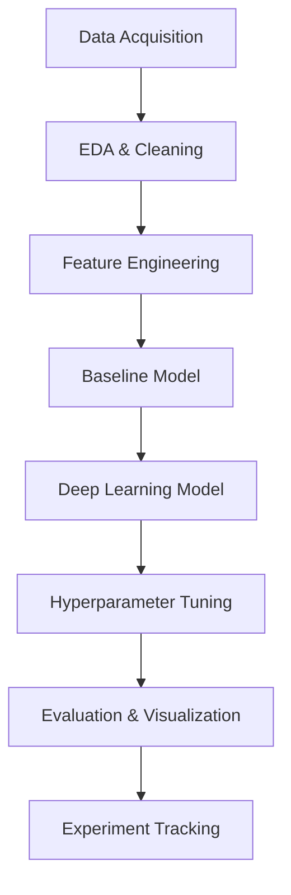

# Customer Churn Rate Prediction


<p align="center" >
   
</p>

## Table of Contents
- [Overview](#overview)
- [Workflow](#workflow)
- [Data](#data)
- [Setup](#setup)
- [Requirements](#requirements)
- [Modeling Pipeline](#modeling-pipeline)
- [Results & Visualizations](#results--visualizations)
- [Experiment Tracking](#experiment-tracking)
- [Usage](#usage)
- [Contributing](#contributing)
- [License](#license)
- [Authors](#authors)

---

## Overview
Predicting customer churn is critical for telecom companies to retain clients and optimize business strategies. This project leverages deep learning and advanced feature engineering to build robust models for churn prediction using the [Telco Customer Churn dataset](https://cdn.discordapp.com/attachments/1292956052106772552/1374000164322283520/WA_Fn-UseC_-Telco-Customer-Churn.csv?ex=6835069e&is=6833b51e&hm=2f7d8cecc73a831f6490e7898e878f26c468e4f39c90c89870fe78d9152f5297&).

**Key Features:**
- Exploratory Data Analysis (EDA) & Visualization
- Feature Engineering (interaction, polynomial, one-hot)
- Baseline & Deep Learning Models (Logistic Regression, TensorFlow/Keras)
- Hyperparameter Optimization (Optuna)
- Experiment Tracking & Model Checkpoints
- Visual performance metrics (Confusion Matrix, ROC, Feature Importance)

---

## Workflow


---

## Data
- **Source:** American telecom client base ([Download CSV](https://cdn.discordapp.com/attachments/1292956052106772552/1374000164322283520/WA_Fn-UseC_-Telco-Customer-Churn.csv?ex=6835069e&is=6833b51e&hm=2f7d8cecc73a831f6490e7898e878f26c468e4f39c90c89870fe78d9152f5297&))
- **Goal:** Predict if a customer is at risk of contract termination (churn)
- **Location:** Place the CSV in the `data/` folder

---

## Setup
1. **Clone the repository:**
   ```bash
   git clone https://github.com/MichAdebayo/customer-churn-rate-prediction.git
   cd customer-churn-rate-prediction
   ```
2. **(Optional) Create and activate a virtual environment:**
   ```bash
   python -m venv venv
   source venv/bin/activate  # On Windows use `venv\Scripts\activate`
   ```
3. **Install required packages:**
   ```bash
   pip install -r requirements.txt
   ```

---

## Requirements
- Python 3.8+
- Jupyter Notebook or JupyterLab
- See `requirements.txt` for all dependencies:
  - numpy, pandas, scikit-learn, tensorflow, keras, matplotlib, seaborn, optuna, optuna-dashboard, statsmodels, shap

---

## Modeling Pipeline
### 1. EDA & Data Cleaning
- Missing value handling, type conversion
- Distribution plots for numeric features
- Chi-square & t-tests for feature relevance
- Correlation heatmaps

### 2. Feature Engineering
- Label encoding, one-hot encoding
- Interaction features (e.g., contract × payment method)
- Polynomial features & scaling
- Service count, tenure categories, spend rate

### 3. Baseline Model
- Logistic Regression (with/without feature engineering)
- Evaluation: ROC AUC, classification report, confusion matrix

### 4. Deep Learning Model
- TensorFlow/Keras sequential model
- Multiple hidden layers, sigmoid activations
- Class weighting for imbalance
- Training/validation/test split
- Evaluation: Accuracy, AUC, ROC curve, confusion matrix

### 5. Hyperparameter Optimization
- Optuna for automated tuning
- Study database: `optuna_study.db`
- Dashboard: `optuna-dashboard`

---

## Results & Visualizations

> *See `main.ipynb` for code and output visualizations.*

---

## Experiment Tracking
- **Model checkpoints:**
  - `notebooks/checkpoints/tf_model_3/best_model.keras`
  - `notebooks/checkpoints/tf_model_4/best_model.keras`
- **TensorBoard logs:**
  - Training/validation logs in `notebooks/logs/fit/tf_model_3/` and `tf_model_4/`
- **Optuna study:**
  - `optuna_study.db` for hyperparameter search

---

## Usage
- Open and run `notebooks/main.ipynb` for the full pipeline
- Modify and experiment with feature engineering and model architecture
- Visualize results directly in the notebook

---

## Contributing
Contributions are welcome! Please:
1. Fork the repository
2. Create a new branch (`git checkout -b feature-name`)
3. Make your changes
4. Submit a pull request

---

## License
This project is licensed under the MIT License. See the [LICENSE](LICENSE) file for details.

---

## Authors
- Michael Adebayo : [GitHub](https://github.com/MichAdebayo)
- Samuel Thorez-Debrucq : [GitHub](https://github.com/SamuelTD/)
